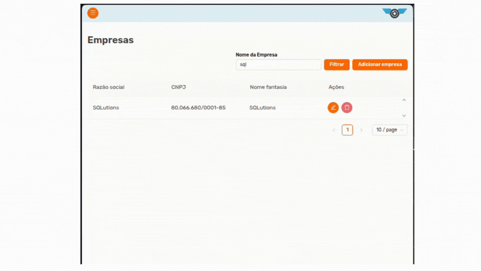

# Glória Felix de Brito

## Introdução

Olá! Sou estudante do curso superior tecnólogo em Banco de Dados da FATEC São José dos Campos, da turma de 2024 - atual 4º semestre. Tenho uma primeira graduação em Ciências Biológicas pelas Universidade Federal de Pernambuco, graduação em Análise e Desenvolvimento de Sistemas -ADS pela Uniamérica e estou em transição de carreira para área de TI

  

## Meus Principais Conhecimentos
Atualmente exploro o universo da tecnologia e sou graduanda do curso de Banco de Dados pela Faculdade de Tecnologia de São José dos Campos — FATEC SJC, além de ser graduada em Análise e Desenvolvimento de Sistemas pela Uniamérica. Tive a oportunidade de atuar como Desenvolvedora Estagiária na Buser Brasil pelo programa BuserTech, onde adquiri experiência como desenvolvedora web full stack utilizando Python e o framework Django no back-end, e JavaScript com o framework Vue.js no front-end.
Também possuo conhecimento em Docker, HTML, CSS, Git, SQL e Linux. Atualmente, trabalho como Engenheira de Dados Júnior, participando de projetos que utilizam a Google Cloud Platform na construção de Agentes de IA: Desenvolvo prompts e agentes de IA utilizando tecnologias da Google Cloud, como Gemini, Vertex AI e outras ferramentas do ecossistema. Estruturação de Data Lakes: Crio pipelines de dados para carga, organização e atualização de Data Lakes, com o objetivo de entregar ambientes estruturados para uso interno e para clientes externos. Estruturação de Data Warehouses: Realizo tratamento, limpeza e organização de dados para construção de Data Warehouses completos e eficientes, também visando entregas consistentes tanto para uso interno quanto para clientes.

## Meus Projetos

### Em 2025-1

Durante o primeiro semestre de 2025, eu e a equipe que faço parte SQLutions, desenvolvemos um sistema de registro de movimentações (pontos) para a empresa ALTAVE. A aplicação foi construída para registrar entradas e saídas de funcionários terceirizados que trabalham em ambientes críticos, com o objetivo de apoiar a ALTAVE no controle de horários, horas trabalhadas e relatórios analíticos.

## Empresa Parceira: [ALTAVE](https://altave.com.br/home/)  &nbsp; 

A ALTAVE é uma empresa brasileira de tecnologia, com sede em São José dos Campos (SP), que atua globalmente com soluções de monitoramento inteligente por meio de vídeo analytics e inteligência artificial. 
Fundada em 2011 por dois engenheiros do ITA, a ALTAVE foi pioneira no uso de aeróstatos (balões cativos) para vigilância aérea persistente. 
Seus produtos combinam hardware (balões, torres móveis, câmeras) com software proprietário, como o ALTAVE Harpia, para gerar alertas em tempo real, insights preditivos e reforçar a segurança operacional em setores como Óleo & Gás, Mineração, Portos, Defesa, Agronegócio e Energia. 

Além disso, a ALTAVE é reconhecida como Empresa Estratégica de Defesa (EED) pelo Ministério da Defesa. 
DefesaNet

## Problema

A ALTAVE enfrentava um desafio operacional: nas áreas de manutenção de grandes embarcações, trabalham funcionários de empresas terceirizadas. Era necessário ter controle preciso sobre os horários de entrada e saída desses profissionais para garantir cumprimento de contratos, segurança, e evitar prejuízos financeiros elevados. Esse controle manual ou pouco estruturado podia gerar erros, atrasos, fraudes ou simplesmente não fornecer dados suficientes para tomadas de decisão.

 - Solução Entregue pela Equipe: 

Desenvolvemos uma aplicação web para a ALTAVE que atende exatamente esse problema. As principais funcionalidades são:

- Cadastro de funcionários e empresas terceiras.

- Registro de ponto (entrada e saída) por funcionário, com persistência no backend.

- Exibição de tabelas com histórico de movimentações.

- Dashboards com gráficos (como horas trabalhadas por período, presença, ausências) para facilitar a análise de dados.

- Exportação de relatórios em planilha (por exemplo, CSV) para uso em auditorias, contratos ou gestão.

- Filtros para consulta de registros por data, funcionário, empresa, período, etc.

Com isso, a ALTAVE ganhou uma ferramenta para gerenciar eficientemente os registros de ponto terceirizado, automatizar relatórios para auditoria e garantir mais transparência e controle nas suas operações.

## GIT e GitHub

Todo o código do projeto foi versionado utilizando Git, adotando um fluxo organizado de desenvolvimento com branches de feature, pull requests para revisão de código e integração contínua entre os integrantes da equipe.
O repositório é hospedado no GitHub, que utilizamos para centralizar o código, acompanhar issues, gerenciar PRs, documentar o projeto e facilitar a colaboração entre todos.

[Repositório oficial do projeto](https://github.com/SQLutions-FATEC/API-3-Semestre)

## Tecnologias Utilizadas

Principais tecnologias usadas no projeto e por que cada uma foi importante:

 ### Vue.js   &nbsp;
- Vue.js é um framework JavaScript progressivo para criação de interfaces de usuário. Ele permite construir aplicações web reativas, baseadas em componentes, com uma curva de aprendizado acessível e excelente desempenho.
No projeto, foi utilizado para desenvolver toda a interface web, com formulários dinâmicos, tabelas, navegação e dashboards interativos.

### Ant Design Vue  &nbsp; 
- Ant Design Vue é uma biblioteca de componentes UI baseada no famoso Ant Design. Ela oferece uma coleção extensa de elementos visuais prontos, responsivos e com design profissional.
No projeto, agilizou a construção de telas ao fornecer componentes como tabelas, modais, menus e inputs totalmente estilizados e padronizados.

## Java  &nbsp; 
- Java é uma linguagem de programação robusta, orientada a objetos e amplamente utilizada em sistemas corporativos. É conhecida por sua segurança, estabilidade e grande ecossistema de bibliotecas.
No projeto, foi usada no backend para implementar a lógica de negócio, validações, regras de cálculo e manipulação de dados.

## Spring Boot  &nbsp; 
- Spring Boot é um framework que simplifica a criação de aplicações Java modernas, principalmente APIs REST. Ele oferece configuração automatizada, servidor embutido e suporte completo para injeção de dependências.
No projeto, permitiu estruturar a API REST, criar endpoints, gerenciar serviços e repositórios, além de facilitar integrações com banco de dados e segurança.

## PostgreSQL  &nbsp; 
- PostgreSQL é um banco de dados relacional de código aberto, reconhecido por sua confiabilidade, performance e suporte a SQL avançado.
No projeto, foi utilizado para armazenar todas as informações estruturadas, como dados de funcionários, empresas, movimentações e relatórios.

## Docker  &nbsp; 
- Docker é uma plataforma de containerização que permite empacotar aplicações e seus ambientes em contêineres isolados e replicáveis.
No projeto, garantiu que frontend, backend e banco de dados fossem executados em ambientes consistentes tanto no desenvolvimento quanto na produção, eliminando problemas de configuração entre máquinas.

## Contribuições Pessoais

#### Frontend (Vue.js / Ant Design Vue)

Criação das telas de cadastro de funcionário e empresas terceiras. Utilização de componentes do Ant Design Vue para formular formulários (inputs, selects, validações) e agrupá-los em páginas amigáveis e manipulação do calendário dos filtros.

Ajustes de label com CSS para tornar a visulaização mais amigável e coerente entre as páginas. 

#### Backend (Java + Spring Boot)

Implementação de lógica para relatórios: consulta com filtros, agregações para gerar os dados que alimentam os dashboards do front.

#### Infraestrutura / DevOps

Uso de Docker para containerizar os serviços: backend em um contêiner, banco de dados PostgreSQL em outro.

Criação de docker-compose para orquestrar os serviços localmente, facilitando o setup para toda a equipe.

Familiaridade com a documentação de uso do ambiente Docker (como levantar os contêineres, variáveis de ambiente, volumes).

## Hard Skills

Vue.js: nível básico/intermediário — criação de componentes, trabalho com estado, formulários, comunicação com API.

Ant Design Vue / CSS: nível intermediário — estilização de páginas, utilização da biblioteca de forma eficiente, e adaptação de componentes para nossas necessidades.

Java (POO): nível básico — trabalhei com orientação a objetos, tratamento de exceções, collections, streams.

Spring Boot: nível básico — desenvolvimento API REST, gerenciamento de dependências, configuração de ambiente.

PostgreSQL / SQL: básico a intermediário — modelar entidades, consultas simples e agregações para relatórios.

Docker: intermediario — criação de Dockerfiles, docker-compose, entendimento de volumes, redes e variáveis de ambiente.

## Soft Skills

Comunicação: Durante as reuniões semanais da equipe, tive que explicar minhas ideias para colegas sobre o que estava sendo desenvolvido (frontend, backend).

Trabalho em equipe: Colaborei estreitamente com membros do backend para integrar a API com o front-end; pedi ajuda quando travava em alguma parte, e ajudei outros com minhas soluções quando podia.

Resolução de problemas: Quando havia divergências na lógica de negócio (por exemplo, formatos incoerentes entre o front e back), discuti com o time, pensamos em diferentes abordagens e definimos uma solução técnica robusta.

## Recomendações / Melhorias Futuras

Para tornar o sistema ainda mais completo e valioso para a ALTAVE, algumas melhorias e evoluções poderiam ser consideradas:

- Autenticação e autorização: implementar login, perfis de usuário (admin, gestor, terceirizado), para diferenciar quem pode ver ou exportar relatórios.

- Notificações: alertas quando um funcionário não registra saída após determinado horário, ou quando há inconsistências no ponto.

- Integração com sistemas externos: permitir importação de dados de outros sistemas de RH ou de controle de jornada, para automatizar ainda mais.

- Relatórios mais avançados: permitir relatórios mensais, por projeto, por tipo de terceirizado, gráficos de comparação entre períodos.

- UI/UX: refinar a interface para torná-la mais amigável para gestores, adicionando filtros salvos, dashboards customizáveis.

- Monitoramento e logs: adicionar registro de logs, auditoria para saber quem exportou o quê e quando, e monitorar a performance da aplicação.

I

