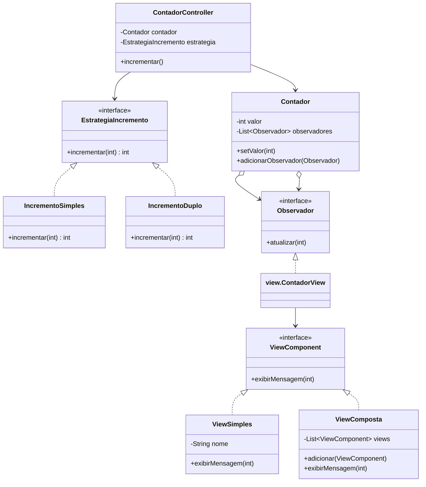

```mermaid
classDiagram

%% ========== Strategy ==========
class EstrategiaIncremento {
    <<interface>>
    +incrementar(int) int
}

class IncrementoSimples {
    +incrementar(int) int
}

class IncrementoDuplo {
    +incrementar(int) int
}

EstrategiaIncremento <|.. IncrementoSimples
EstrategiaIncremento <|.. IncrementoDuplo


%% ========== Observer ==========
class Observador {
    <<interface>>
    +atualizar(int)
}

class Contador {
    -int valor
    -List~Observador~ observadores
    +setValor(int)
    +adicionarObservador(Observador)
}

Observador <|.. view.ContadorView
Contador o--> Observador


%% ========== Composite ==========
class ViewComponent {
    <<interface>>
    +exibirMensagem(int)
}

class ViewSimples {
    -String nome
    +exibirMensagem(int)
}

class ViewComposta {
    -List~ViewComponent~ views
    +adicionar(ViewComponent)
    +exibirMensagem(int)
}

ViewComponent <|.. ViewSimples
ViewComponent <|.. ViewComposta


%% ========== MVC Controller ==========
class ContadorController {
    -Contador contador
    -EstrategiaIncremento estrategia
    +incrementar()
}

ContadorController --> Contador
ContadorController --> EstrategiaIncremento
view.ContadorView --> ViewComponent
Contador o--> Observador
```

